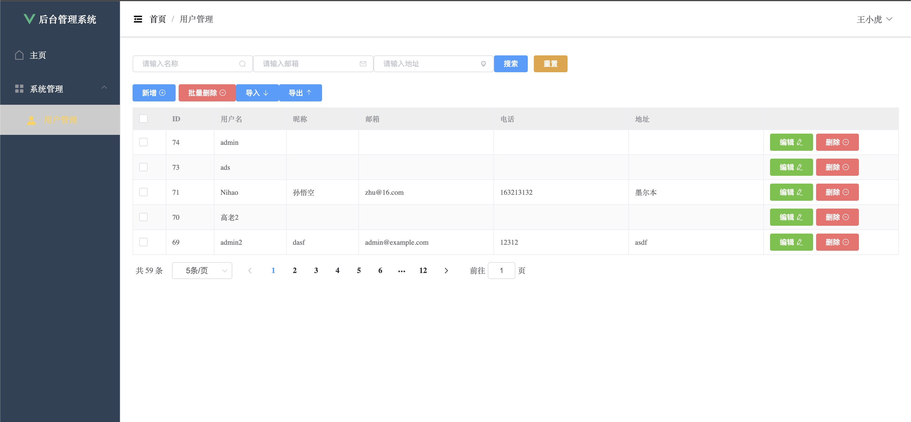

# Student Management System
- `Author:` @luoxisteven
- `Tutor:` @qinge (@Copyright)
This is a frontend and backend project for a student management system from https://www.bilibili.com/video/BV1U44y1W77D/.

## Functionalities
1) Registration and Login
2) CRUD operations for users (Create, Read, Update, Delete)
3) Paginated queries
4) Registration and Login
5) JWT (JSON Web Token)

## Website
  

## Packages
1) Springboot
    - Website: https://spring.io/projects/spring-framework
2) Vue
    - Website: https://vuejs.org/guide/introduction.html
    - ElementUI
    - Axios
        - Install: `npm i axios -s`
        - Check if Axios is installed: `npm list axios`
        - Configure `request.js`
3) MySQL
4) MyBatis
5) MyBatis-Plus 
    - Website: https://mybatis.plus/
    - Simplifies CRUD operations without SQL
    - Code Generator (Apache Velocity)
6) Lombok
    - Simplifies constructors and methods
7) Hutool
    - File Writer

## Build
1) Vue
    - `vue create <filename>`
2) SpringBoot
    - VSCode: Install Extension "Spring Initializr Java Support"
    - Type `>` in the search box
    - Then type `vscode-spring-initializr`
    - Click `Spring Initializr: Create a Maven Project`

## Run
1) Frontend (Vue):
    - First `cd` into the Vue folder
    - Run in the Vue folder: `npm run serve`
    - Website: http://localhost:8080/
2) Backend (Springboot):
    - Run from `SpringbootApplication.java`
    - Website: http://localhost:9090/

## User
Website: http://localhost:9090/user
```
Postman: 
    Get:
        localhost:9090/user/page?pageSize=20&pageNum=1&username=&email=&address=&nickname=
    Post: (Body: JSON) Both Delete and Update use Post
    {
        "username": "abc",
        "password": "dasdf",
        "nickname":"asdfasdfasd"
    }
    Delete: 
        http://localhost:9090/user/{id}
```

## Resources (src/main/resources)
Different configuration files:
1) application.yml
2) mapper/User.xml - After configuring xml, it needs to be configured in application.yml

## Random Notes
- MyBatis
    A framework for database CRUD operations
- MyBatis-Plus
    Finish P8.zip contains code before using Plus

## SpringBoot Notes
CSDN Website: https://blog.csdn.net/cuiqwei/article/details/118188540
1) Controller connects HTTP requests and data (com.example.springboot.controller;)
2) Mapper connects HTTP and backend data (com.example.springboot.mapper;)
3) Service can connect Controller and Mapper (com.example.springboot.service;)
- Controller handles requests and responses, connecting HTTP requests with business logic (Service).
- Service handles business logic, connecting Controller and data access layer (Mapper).
- Mapper handles database operations, connecting business logic layer (Service) and database.

## HTML Notes
- Cannot have multiple divs in parallel. If needed, wrap them in an outer div.
